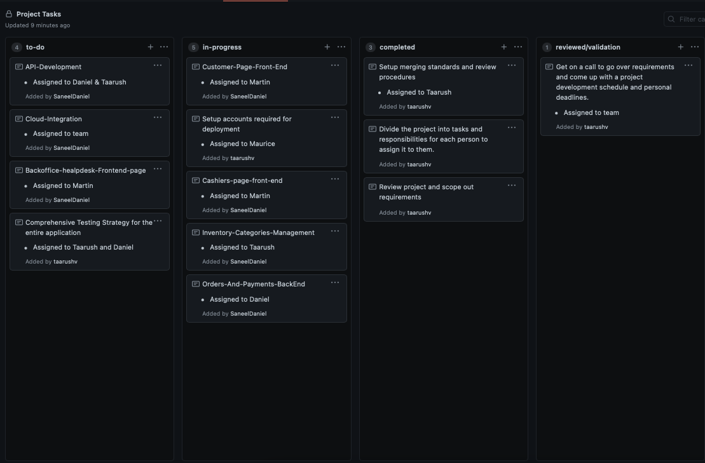

# CMPE 172 - Starbucks Project - Team Journal - Go Team

# Team Project (Go Team)

## Introduction

Problem Statement:

The team has been selected to bid on work for the next version of Starbucks's Online Store and Back office Apps

REQUIREMENTS:

1. Cashier's App (Frontend & Backend)

2. Online Store & Backoffice Help Desk

3. REST API

4. Backoffice Help Desk & Integrations

Team Members: - Martin Vladimirov - Maurice Washington - Saneel Daniel - Taarush Vemulapalli

## { Cashiers App }

Once our user creates an order, they will be redirected to our cashiers page. This will display the Order ID number, different items, and the price.

Front End managed by Martin Vladimirov, and backend managed by Taarush Vemulapalli

## { Online Store & Backoffice Help Desk }
In order to run the front end , first type `cd final-frontend`. 

Run `npm install` and then `npm run start`

Our online store displays a variety of different drink categories that users can browse.

If a user makes a report, we can view them from our backoffice help desk and resolve issues that our users may have.

Front End managed by Martin Vladimirov, and backend managed by Saneel Daniel

## { REST API }

Design and Development to be done by Taarush Vemulapalli and Saneel Daniel

# Team Journal

## Week 1 (Project Kickoff) - (4/16/21 - 4/21/21)

- The team had meetings to discuss the requirements and setup the initial layout.
- We had discussion over responsibility division and task allocations.
- We had brainstorming session on how to start the bare-bones templates and move further from there.
- We concluded the week with task allocations and reviewing the necessary starter codes and will be laying out a boilerplate up within the next couple of days.

